# CS205-ADMM
Group 17 final project for Harvard CS 205, Spring 2020.
 
### Required Software

This implementation requires on `xtensor` and the closely related library `xtensor-blas`. 
For optimal performance, one should also use `xsimd`.
The easier way to install these libraries is with Anaconda. The following command will
install these libraries and their dependencies (it is recommended to install these packages in
a fresh conda environment).

```conda install -c conda-forge xtensor xtensor-blas xsimd```

In addition to these libraries, we use CMake to compile our code and Intel's C++ compiler, 
Math Kernel Library, and MPI Implementation. This software is all available on the Harvard Cluster.
The following command will load them all using the LMod package manager: `source gogo_modules.sh`.

Before compiling our code you need to tell cmake where the xtensor headers live. 
On the Harvard cluster, where user created conda environments live in 
`~/.conda`, one should run 

```cmake -DCMAKE_INSTALL_PREFIX=~/.conda/envs/your_xtensor_env_name```.

Example for running the generate_lasso_data.py:

```python3 generate_lasso_data.py 160 500 30 1```


# Dirtributed ADMM

In order to discuss distributed implementation of ADMM, we start with introducing the preliminaries: *Dual Ascent, Dual Decomposition and Augmented Lagrangian*, as the fundations to ADMM.

## Dual Ascent

Consider the equality-constrained convex optimization problem 
<p align="center">
 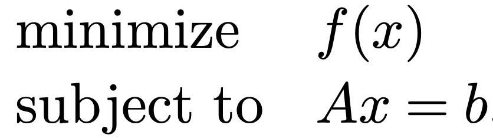
</p>

The corresponding Lagrangian dual function is defined as 

<p align="center">
 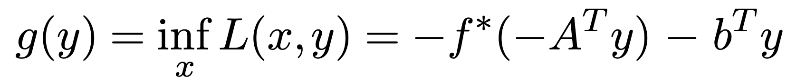
</p>

Assuming strong duality holds, the primal optimizer can be recovered by first finding the dual optimizer as follows

<p align="center">
 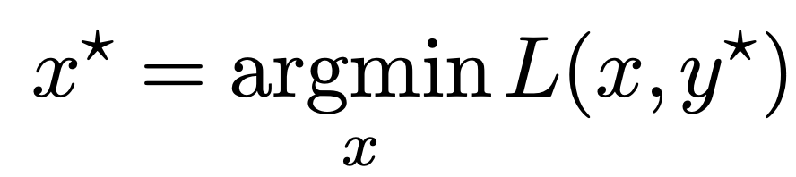
</p>

The *dual ascent method* is inspired by this idea, following the two steps: (1) Update the dual variable by ascending in the dual gradient direction, which equals to the residual of the equlity constraint, (2) Update the primal variable by minimizing the Lagrangian, fixing the dual variable:

<p align="center">
 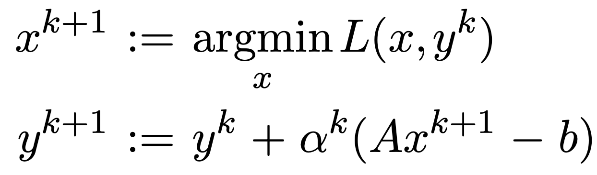
</p>

## Dual Decomposition

Consider special problems where the objective function is *separable* with respect to a partition of the primal variable (which is often the case in machine learning problems where the objective function is a summation of local cost functions w.r.t. data sample):

<p align="center">
 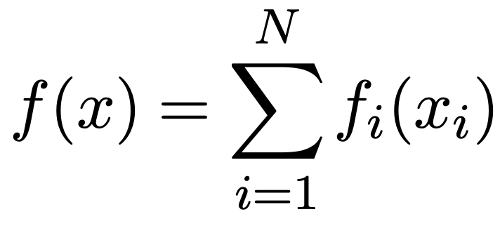
</p>

In this case, the Lagrangian can also be decomposed

<p align="center">
 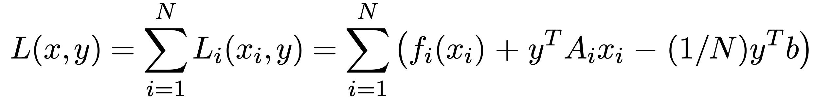
</p>

This decomposition leads to a separation of the update rule, which is referred to as *dual decomposition*

<p align="center">
 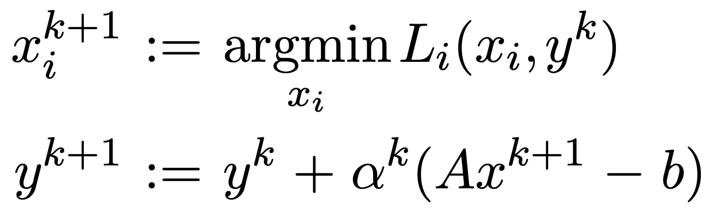
</p>

This form is desirable for distributed optimization.

## Augmented Lagrangians and the Method of Multipliers

The problem of dual decomposition is that it requires strict convexity and finiteness of the objective function for convergence, which is a quite strong assumption in reality that can be difficult to satisfy. The augmented Lagrangian method was developed to make dual ascent method more robust to yield convergence without satisfying those strict requirements. This is done by adding an additional quadratic penalty term to the original objective function

<p align="center">
 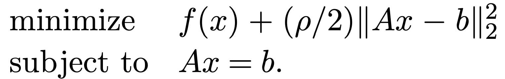
</p>

As the added penalty term vanishes for all the feasible primal variables, this does not change the result of the optimization.

The dual decomposition update rule with augmented penalty is 

<p align="center">
 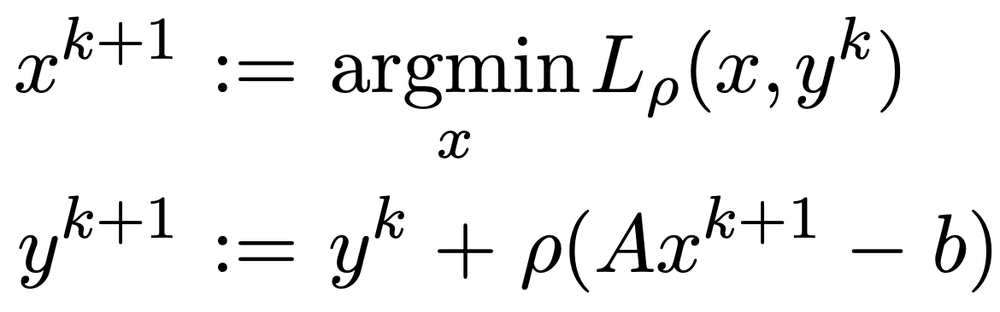
</p>

Note that the dual update step size is now the penalty parameter. The reason of making this choice is to make sure that each iteration the pair of the primal and dual variable is dual feasible. The primal minimization problem is changed to the Lagrangian with the penalty term. This is referred to as *the method of multiplers*. The method converges under far more general conditions than dual ascent.


# Dirtributed Lasso

In this project, we consider L1 regularized linear regression, which is a standard machine learning problem:

<p align="center">
 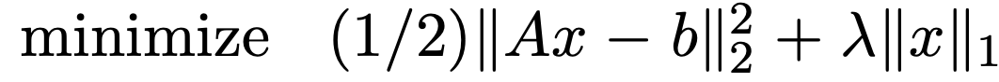
</p>

The associated ADMM update is as follows:

<p align="center">
 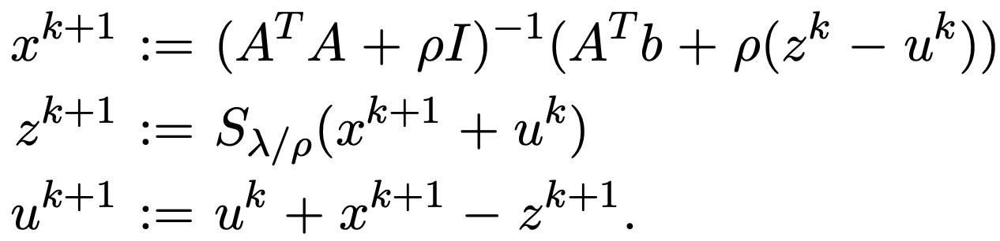
</p>

For efficiency consideration, the matrix inversion is calculated at the beginning, and cached for later multiplication.

The following diagrams illustrate how to distributedly implement the above equations by partitioning the data across several nodes.

<p align="center">
 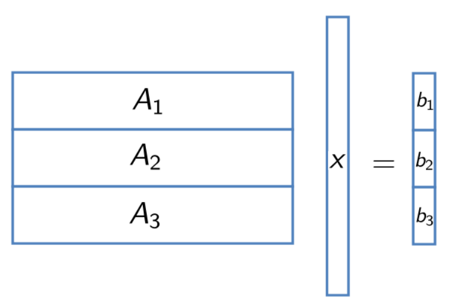
</p>

<p align="center">
 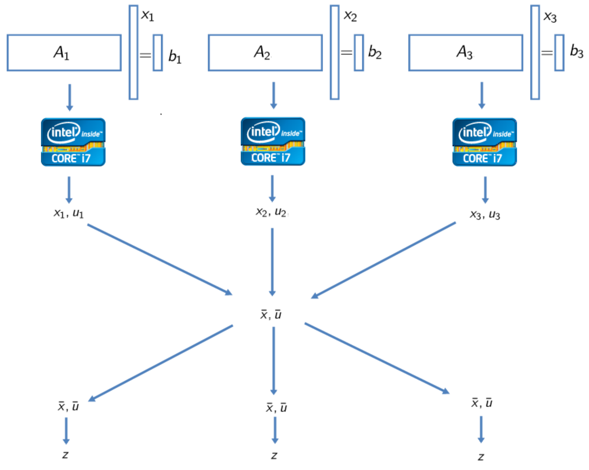
</p>

This distributed implementation can be summarized into 4 key steps:

Initilization:Each node reads in the local matrix data into its local memory, and initlize local deicison variables *x* and *u*.

---

Local optimization: Each node solves its local optimization problem (in Lasso, this local optimization is a ridge regression).

---

Global aggregation: All the nodes communicate their local variables for averaging and broadcast the results back to all the nodes. We use MPI AllReduce to accomplish this aggregation.

---

Synchronization: Synchronization between nodes must be enforced for the correctness of the implementation: All the local variables must be updated before global aggregation, and the local updates must all use the latest global variable.


