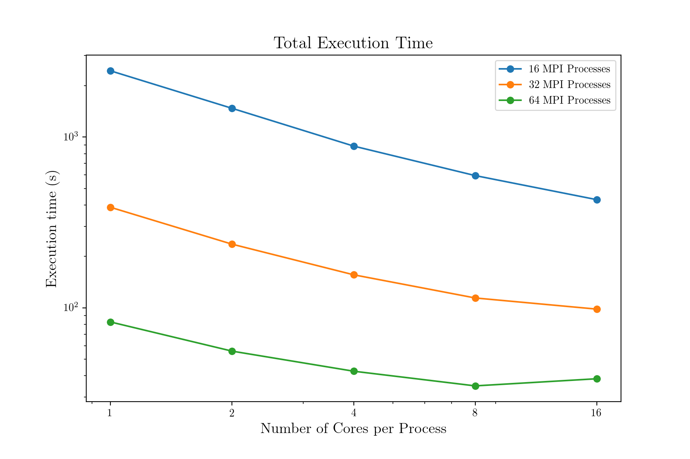
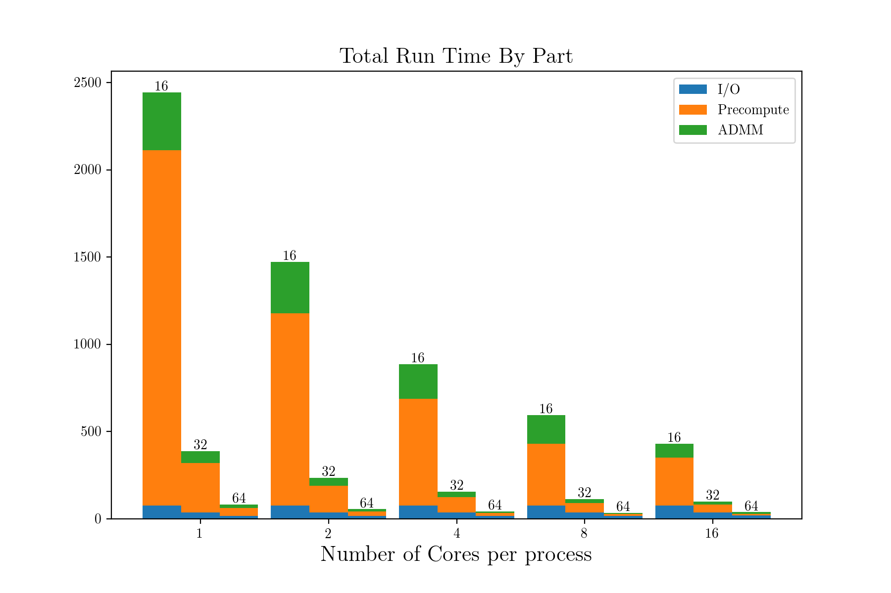
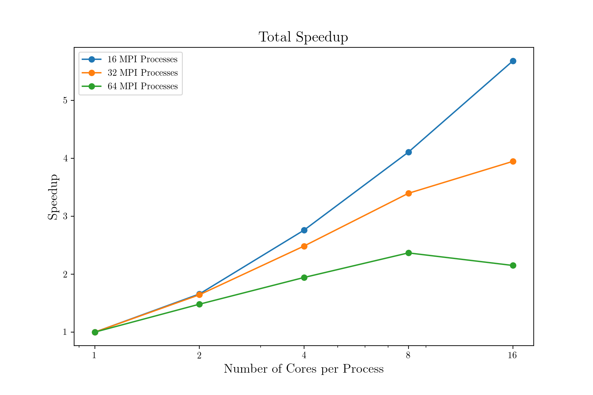
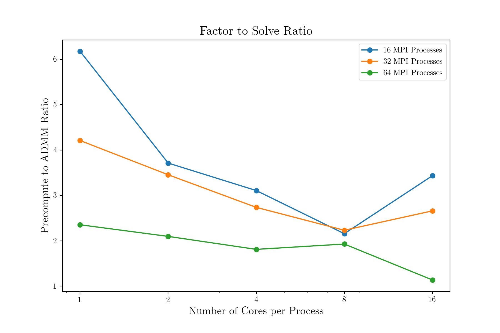

# Performance Testing

### Reproducibility

- The tests below were run on the `shared` partition of the Harvard cluster
  - CentOS Linux release 7.6.1810 with x86_64 
  - Each node contains an Intel Xeon Cascade Lake processors with 48 Cores, 196 Gb RAM, and 48 Mb of cache
  - Nodes are connected with Infiniband Fabric
  - Data was read from and written to global scratch storage which is a Lustre Parallel file system
  - We requested resources through the SLURM scheduler and for all different combinations of MPI processors and OpenMP threads requested 4Gb of memory for each CPU. In practice we requested 16 cpus per task and set the number of threads with the environment variable `OMP_NUM_THREADS`.

- Software specifics
  - Code was compiled with C++ 14 Standards using Intel C compilers version 18.0.5
  - Intel MPI version 2018 build 4
  - Intel MKL version 2019 build 5
  - xtensor 0.21.5
  - xtensor-blas 0.17.2
  - xtl 0.6.13
  - xsimd 7.4.7
 
- Compiling and running the tests
  - The source code to run these tests is (`src/lasso_reg_path.cpp`)[src/lasso_reg_path.cpp] 
  - It was compiled with CMake which generates the executable `lasso_reg_path`
  - The script `thread_test.sh` changes the number of MPI processes and OpenMP threads and directs output of the file to a directory that is hard coded in the file.

### Tests

To test how our implementation scaled with different computing resources we
solved the lasso problem for a total A matrix of size 640,000 x 8000 (examples by features) and 
systematically varied the number of MPI Processes and the number of OpenMP threads. This data was dense
with floating point numbers so occupied ~ 41 Gb of memory. We divided this dataset by examples into 
128 different files and read a number of files into each MPI process separately (while keeping the problem
the identical across different runs). 

Since our performance was largely limited by the amount of I/O required, 
we chose to evaluate not just a single lasso problem, but
rather to compute the entire regularization path, i.e. to vary the hyperparameter `lambda` over a range
of values since it is impossible to know a priori what the best value to use for a given problem is. 
This allowed us to get more information and computation out of our data once it was loaded into memory.
A further optimization that this allowed us to take advantage of is a so called warm start, where we 
use the optimal values of x and z from the previous iteration as the starting point for the next.
Changes in the regularization parameter change where the 

To assess performance, we timed various parts of the calculation, specifically we computed the time to
read in the data which we call I/O time, the time to compute relevant quantities described
above (`A^T b` and `(rho *I + A^TA)` or `(I + (1/rho)*AA^T)` depending on the dimensions of the matrix) which we call precompute time, and the time to solve the ADMM problem for 10 different values of `lambda`. 
We also track the total number of ADMM iterations that were required for the entire regularization path
to estimate the per step time.

### Performance Model

We would expect that the problem should scale strongly with the number of MPI processors because I/O is
a bottleneck and the speedup in IO should be proportional to the number of processors simultaneously performing I/O. The next most significant contribution to speedup is from the precomputation time. 
For concreteness lets say that each processor has an A matrix that is M x N and a b vector that is 
length M. The matrix vector product A^T b involves N x M^2 flops. One of two symmetric matrices is computed
both of which involve approximately 0.5 M^2 N^2 flops. This symmetric matrix is then inverted using 
cholesky factorization which requires (2/3) x min(N^3,M^3) flops. Since these matrix operations are
all carried out by calls to the Intel MKL BLAS implementation, we expect that increasing the number of threads
will speed up this step significantly. Finally, there is the ADMM loop itself which also involves matrix operations
and should also improve with more threads.

### Results

 

 

The figures above show the total execution time for the problem described above
and the total runtime broken down into constituent parts.
We ran the regularization path code with 16, 32, and 64 MPI processed each with 
1, 2, 4, 8, and 16 threads per core. Increasing the number of processes is the most significant driver in speedup
since it reduces the problem size for all the processes and in so doing speeds up all three parts of execution
time. Consistent with our performance model we see that the I/O time is approximately constant for a given number of processes. We can also observe that increasing the number of threads speeds up the computationally intensive steps
of precomputing matrix operations and running the optimizer but not as strongly
as increasing the number of MPI processes.

 

Next we consider the speedup achieved byusing multiple threads. We see that with
fewer processes, where each one has to perform more operations in the precompute
and ADMM sections of the code, threads give a larger speedup than in the case of 
more processors where each processor has a smaller problem to solve. The above plot
also suggests that with the problem divided among 64 MPI processes the overhead due to 
communication may begin to become significant. The fact that this only begins to be an
issue with 64 processes is impressive and likely due to the high speed InfiniBand 
fabric that connects the nodes of the cluster and that there is relatively little
communication between nodes for this problem.

 

A final performance metric that we consider is the "factor to solve ratio", which in our case
is the ratio of time spent to perform the precomputed matrix operations to the time spent working
through the ADMM loop. In all cases considered here, the factor to solve ratio is greater than 1.
This suggests that further iterations of the main ADMM loop either due to reducing the convergence 
tolerances or by searching though a larger set of regularization values could be performed relatively
cheaply. For instance when using 8 cores per process each version has a factor to solve ratio of about 2
which means that if we doubled the number of ADMM iterations we would increase "computational" time by 
about 1/3 and the total runtime by even less since the I/O operations would only need to performed once.

### Conclusions

These tests reveal that our ADMM implementation can be very effectively scaled to a large number 
of processes. By taking advantage of multiple levels of parallelism and highly optimized libraries
we find that a moderate amount of initial work in terms of I/O and upfront linear algebra allow one
to very cheaply compute the regularization path for the lasso regression problem. Though we considered a
specific problem here, ADMM is flexible enough to solve a large class of problems and with minimal changes
(especially thanks to the straightforward syntax of `xtensor`) our code could be adapted to solve many 
other problems at large scale.

**Data Availability**  All the timing data for the plots here were calculated using `MPI_Wtime`. The raw output from the test which includes output from 
the optimizer and timing (at the very end) are in [`perf_results`](/perf_results).
The files are named according to `output_nprocesses_nthreads.txt`.That data was processed in
python and plotted using matplotlib which can be seen in this [notebook](performance_analysis.ipynb).
